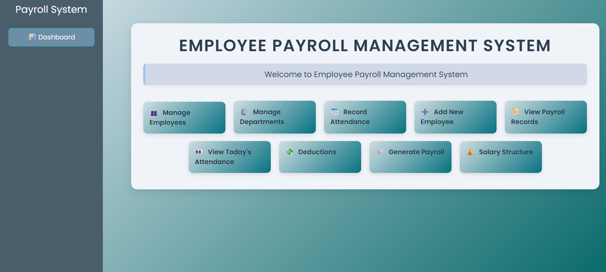

# Employee-Payroll-Management-System-Using-SQL-and-Flask

# ➤ Description
This is a database-driven payroll system built using Python (Flask) and PostgreSQL. It allows HR managers to manage employees, departments, attendance, deductions, and generate payrolls with ease.

# 📌 Problem Statement
- Managing employee payroll manually can be time-consuming, error-prone, and inefficient—especially for growing organizations. Key challenges include accurate salary calculation, tracking attendance, managing deductions, and generating     payslips while ensuring compliance with financial regulations.

- This project addresses these issues by building a web-based Employee Payroll Management System using SQL and Flask. It provides an automated solution for handling employee data, attendance, salary structures, deductions, and payroll generation, all within a centralized, secure, and user-friendly interface.

# ➤ Features
- Manage employees and departments
- Record and view attendance
- Configure salary structure and deductions
- Auto-generate payroll with net pay calculation
- Clean, responsive UI using Bootstrap
- SQL-based backend with normalized schema

➤ Technologies Used
- Python (Flask)
- PostgreSQL
- HTML/CSS/Bootstrap
- PgAdmin

